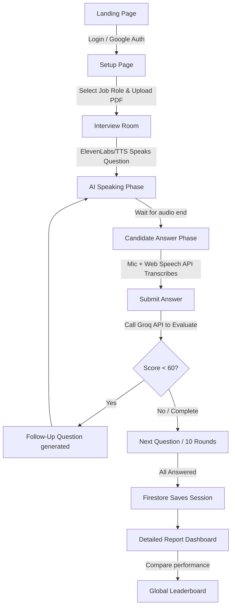

# 🎯 InterviewCoach AI — AI-Powered Mock Interview Platform

InterviewCoach AI is a premium, state-of-the-art mock interview web application. The platform simulates a live interview panel by leveraging real-time facial expression tracking, speech synthesis, speech recognition, and LLM-driven response analysis to provide candidates with comprehensive feedback.

---

## ✨ Features

- **🤖 LLaMA-3 Powered Interviewer:** Integrates the `llama-3.3-70b-versatile` model via **Groq** to generate highly personalized questions based on candidate resumes and target job roles.
- **😊 Facial Emotion Detection:** Utilizes **`face-api.js`** (`tinyFaceDetector` & `faceExpressionNet`) to analyze and log candidate confidence and nervous indicators through the webcam every 2 seconds.
- **🎙️ Real-time Speech-to-Text:** Implements the **Web Speech API** (`SpeechRecognition`) for hands-free answering, with an active listening interface and automated silence detection.
- **🔊 Multi-tier Text-to-Speech:** Uses **ElevenLabs TTS API** (Rachel Voice) to read interview questions aloud, falling back seamlessly to browser-native `speechSynthesis` if API limits or keys are absent.
- **📄 Client-Side PDF Parser:** Parses text from uploaded PDF resumes locally using a zero-dependency binary stream reader (`FileReader` + RegExp parser) without requiring Firestore/cloud processing.
- **📊 Comprehensive Performance Reports:** Generates an overall score out of 100, lists key strengths, areas for improvement, coaching tips, and renders an interactive emotion timeline graph.
- **🏆 Global Leaderboard:** Ranks candidates globally using scores persisted to **Firebase Firestore** with built-in Google Authentication.

---

## 🛠️ Technology Stack

- **Core Framework:** Next.js 16 (App Router), React 19, TypeScript
- **Styling & Animation:** TailwindCSS, Vanilla CSS, Framer Motion
- **AI & Speech API:** Groq Cloud SDK (LLaMA-3.3 70B), ElevenLabs TTS API, Web Speech API (SpeechRecognition)
- **Computer Vision:** `face-api.js` (Tiny Face Detector, Face Expression Net)
- **Database & Auth:** Firebase Auth, Firebase Firestore SDK
- **Data Visualization:** Recharts (Emotion timeline & scores)

---

## 📂 Project Structure

```
interviewcoach-ai/
├── app/                        # Next.js App Directory
│   ├── api/                    # Backend API Endpoints (Groq Orchestration)
│   │   ├── analyze-answer/     # Evaluates answer relevance, depth, and clarity
│   │   ├── generate-questions/ # Creates 10 role-specific/resume questions
│   │   └── generate-report/    # Computes final scores & actionable feedback
│   ├── interview/              # Interactive Mock Interview Room (Speech & Webcam)
│   ├── leaderboard/            # Global ranking board pulled from Firestore
│   ├── login/                  # Google OAuth sign-in & Bypass (Demo mode)
│   ├── report/                 # Detailed post-session feedback dashboard
│   ├── setup/                  # Role selection & PDF resume upload onboarding
│   ├── globals.css             # Global stylesheet & design tokens
│   ├── layout.tsx              # Root Layout
│   └── page.tsx                # Main Landing Page (Hero, Stats, Feature Showcase)
├── components/                 # Shared UI Components
│   ├── ui/                     # Reusable building blocks (Button, Progress, Spinner)
│   ├── EmotionGraph.tsx        # Recharts timeline rendering
│   ├── EmotionMeter.tsx        # UI badge indicating Confident, Nervous, or Neutral
│   ├── Navbar.tsx              # Application navigation bar
│   └── ScoreCard.tsx           # Individual question-level score breakdown
├── context/                    # React Global State Providers
│   ├── AuthContext.tsx         # Handles Firebase Auth & Mock user sessions
│   └── InterviewContext.tsx    # Manages active questions, responses, & emotion logs
├── hooks/                      # Custom Stateful React Hooks
│   ├── useEmotionDetection.ts  # face-api.js webcam detection loops (2s polling)
│   ├── useSpeechRecognition.ts # Web Speech API engine with robust retry & quiet aborts
│   └── useTextToSpeech.ts      # ElevenLabs speech with native browser TTS fallback
├── lib/                        # Service wrappers & helper utilities
│   ├── elevenlabs.ts           # REST API configuration wrapper for ElevenLabs
│   ├── firebase.ts             # Firebase Client SDK Initializer
│   ├── firestore.ts            # Firestore queries (saveSession, getLeaderboard, user reports)
│   ├── groq.ts                 # Prompt engineering templates for Groq LLaMA models
│   └── pdf-parser.ts           # Local PDF stream parser for text extraction
├── public/                     # Static assets (including face-api model weights)
│   └── models/                 # TinyFaceDetector & FaceExpressionNet model weights
└── package.json                # Project dependencies and script targets
```

---

## ⚡ Setup & Installation

### 1. Prerequisites
- **Node.js** (v18+ recommended)
- **npm** or **yarn**

### 2. Environment Configuration
Create a `.env.local` file in the root directory and add the following keys:

```env
# Groq API Keys (Server-side API calls)
GROQ_API_KEY=gsk_...
NEXT_PUBLIC_GROQ_API_KEY=gsk_...

# ElevenLabs Voice API Keys (Optional - Fallbacks to native browser TTS if empty)
NEXT_PUBLIC_ELEVENLABS_API_KEY=sk_...

# Firebase Web App Keys
NEXT_PUBLIC_FIREBASE_API_KEY=AIzaSy...
NEXT_PUBLIC_FIREBASE_AUTH_DOMAIN=your-project.firebaseapp.com
NEXT_PUBLIC_FIREBASE_PROJECT_ID=your-project-id
NEXT_PUBLIC_FIREBASE_STORAGE_BUCKET=your-project.firebasestorage.app
NEXT_PUBLIC_FIREBASE_MESSAGING_SENDER_ID=...
NEXT_PUBLIC_FIREBASE_APP_ID=1:...
NEXT_PUBLIC_FIREBASE_MEASUREMENT_ID=G-...
```

### 3. Run Development Server
Install dependencies and run:

```bash
# Install packages
npm install

# Start Next.js server locally
npm run dev
```

The application will launch on [http://localhost:3000](http://localhost:3000).

---

## 🔄 Core Application Workflow



### Evaluation & Scoring Metrics

For each answer, the Groq LLaMA-3 model scores the following dimensions from 0 to 100:

| Metric | Evaluation Focus |
| :--- | :--- |
| **Relevance** | How directly the answer addresses the core question. |
| **Depth** | Technical proficiency, conceptual understanding, and structural detail (e.g., STAR method). |
| **Clarity** | Structured communication, brevity, and grammatical clarity. |

If any metric scores below **60**, the model automatically generates a situational follow-up question to help the candidate clarify or expand on their answer.

---

## 🤝 Key Integrations & Helpers

### Web Speech API Error Resilience
The [useSpeechRecognition.ts](file:///c:/Users/Bipin%20Maurya/OneDrive/Documents/interviewcoach-ai/hooks/useSpeechRecognition.ts) hook is configured to gracefully ignore `"aborted"` errors and silently cleanup previous callbacks before launching a new recognition stream. This prevents overlapping threads and resolves device conflicts on mobile/Safari browsers.

### Offline / Spark Firebase Compatibility
No external storage uploading is required for resumes. Resumes are parsed locally on the client's thread using [pdf-parser.ts](file:///c:/Users/Bipin%20Maurya/OneDrive/Documents/interviewcoach-ai/lib/pdf-parser.ts) and converted directly to text for inclusion in LLM prompt templates, ensuring compliance with Firebase Spark tier quotas.
# InterviewCoach-AI

